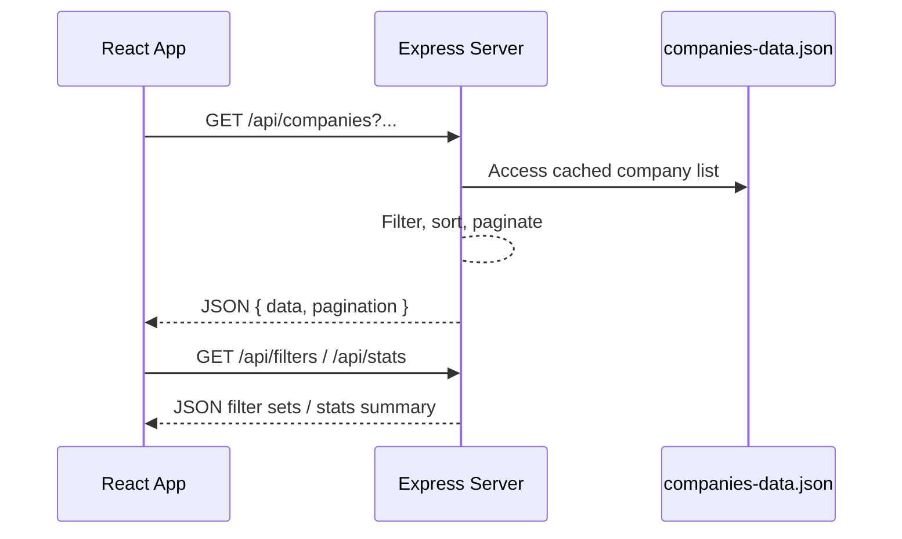

# Companies Directory – Educational Documentation

This document provides a structured, technical explanation of the Companies Directory project. It covers file organization, backend behavior, frontend rendering, and data flow so the application can be understood without prior React or Node.js experience.

---

## 1. Repository Layout

| Path | Purpose |
|------|---------|
| `backend/` | Node.js + Express server that reads company records and exposes REST endpoints. |
| `backend/server.js` | Main server entry point; defines middleware, loads data, and registers routes. |
| `backend/companies-data.json` | Static list of companies with metadata used by the APIs. |
| `frontend/` | React application bundled with Create React App. |
| `frontend/config-overrides.js` | Configures CRA to use `src/index.html` instead of the default public template. |
| `frontend/src/index.html` | HTML shell that hosts the React root element. |
| `frontend/src/index.js` | Bootstraps React, Redux, and Material UI theme before rendering `<App />`. |
| `frontend/src/App.js` | Main UI container; dispatches data fetches and renders components. |
| `frontend/src/app/store.js` | Initializes the Redux store. |
| `frontend/src/features/companies/companiesSlice.js` | Redux Toolkit slice managing data, filters, stats, and view state. |
| `frontend/src/services/api.js` | Axios client for backend communication. |
| `frontend/src/components/` | Presentation components (stats cards, filters, tables, cards, pagination). |
| `frontend/src/index.css` | Global CSS reset and base styles. |

---

## 2. Backend Architecture (`backend/server.js`)

### 2.1 Dependencies and Initialization

```js
const express = require('express');
const cors = require('cors');
const fs = require('fs');
const path = require('path');

const app = express();
const PORT = process.env.PORT || 8000;
```

- **express**: HTTP server framework.
- **cors**: Enables cross-origin requests from the frontend.
- **fs / path**: Read local JSON data reliably.
- `PORT`: Chooses runtime port (defaults to 8000).

### 2.2 Middleware

```js
app.use(cors());
app.use(express.json());
```

- `cors()` responds with CORS headers so browsers can talk to the server.
- `express.json()` parses JSON payloads; important if future endpoints accept POST bodies.

### 2.3 Data Loading

```js
const companiesData = JSON.parse(
  fs.readFileSync(path.join(__dirname, 'companies-data.json'), 'utf-8')
);
```

- Loads the JSON once at startup.
- Keeps all company objects in memory for quick filtering and sorting.

### 2.4 `GET /api/companies`

Responsible for pagination, filtering, and sorting. Steps:
1. **Parse query parameters** with defaults (`page`, `limit`, `search`, `industry`, `location`, `sortBy`, `sortOrder`).
2. **Filtering**:
   - Text search across name/description/location (case-insensitive).
   - Industry and location filters ignore `"all"`.
3. **Sorting**:
   - Supports numeric sorting (employees, founded).
   - Converts string values to lowercase for consistent comparisons.
4. **Pagination**:
   - Computes slice indices from page/limit.
   - Returns metadata (current page, total pages, total companies, navigation flags).
5. **Response structure**:
   ```json
   {
     "success": true,
     "data": [...companies...],
     "pagination": { ... }
   }
   ```
6. Errors are caught and reported with HTTP 500 plus a message.

### 2.5 `GET /api/filters`

- Builds unique sets of industries and locations.
- For location, extracts the country portion by splitting `"City, Country"`.
- Responds with `{ industries, locations }`.

### 2.6 `GET /api/stats`

- Calculates aggregate statistics:
  - `totalCompanies`: number of records.
  - `industriesCount`: distinct industries.
  - `avgEmployees`: rounded average of `employees`.

### 2.7 `GET /health`

- Quick health-check endpoint returning `{ status: 'OK', message: 'Server is running' }`.

### 2.8 Server Startup

```js
app.listen(PORT, () => {
  console.log(`🚀 Server is running on http://localhost:${PORT}`);
  console.log(`📊 Total companies loaded: ${companiesData.length}`);
});
```

- Begins listening for HTTP requests and logs useful diagnostics.

### 2.9 Backend Flow Overview



---

## 3. Frontend Architecture

### 3.1 React/Redux Concepts

- **Single Page Application (SPA)**: `index.html` hosts a single `<div id="root">`; React manages all UI updates inside it.
- **Redux Toolkit**: Provides a centralized store, async thunks, and reducers.
- **Material UI**: Supplies components (AppBar, Cards, Table, etc.) and theming.

### 3.2 Bootstrapping (`src/index.js`)

Key operations:
1. Create a Material UI theme (palette, typography, component overrides).
2. Use `ReactDOM.createRoot` to mount the app.
3. Wrap `<App />` with:
   - `<Provider store={store}>` so every component can access Redux state.
   - `<ThemeProvider>` for MUI theme.
   - `<CssBaseline />` for consistent styling.
4. Import global CSS (`index.css`) for resets and custom scrollbars.

### 3.3 Application Shell (`src/App.js`)

- Imports Redux hooks and selectors from `companiesSlice`.
- On mount:
  - `useEffect` dispatches `fetchFilters()` and `fetchStats()`.
  - Another `useEffect` watches `searchParams` and dispatches `fetchCompanies(params)` whenever they change.
- Defines handler functions that dispatch slice actions:
  - `setSearch`, `setIndustry`, `setLocation` update filters.
  - `setPage`, `setLimit` drive pagination.
  - `setSort` changes sorting criteria.
  - `toggleViewMode` switches between table and card view.
  - `resetFilters` restores defaults (except page size).
  - `handleRefresh` reloads companies and stats.
- Renders:
  - AppBar header.
  - `StatsCards`, `FilterBar`, error and loading states.
  - `CompanyTable` **or** `CompanyCard` based on `viewMode`.
  - `Pagination` plus footer.

### 3.4 Redux Slice (`features/companies/companiesSlice.js`)

- **State shape**:
  - `companies`: current page of company records.
  - `filters`: available industries and locations.
  - `stats`: aggregate numbers.
  - `pagination`: metadata from backend.
  - `searchParams`: query settings (page, limit, search text, selected filters, sorting).
  - `viewMode`: `'table'` or `'card'`.
  - `loading` and `error`: fetch status indicators.
- **Async thunks**:
  - `fetchCompanies(params)`
  - `fetchFilters()`
  - `fetchStats()`
- **Reducers**: update search parameters, pagination, view mode, and reset filters.
- **Selectors**: exported helper functions used by `App.js` to read slice data.

### 3.5 Components Overview

| Component | Role |
|-----------|------|
| `StatsCards.jsx` | Displays total companies, industries count, and average employees. |
| `FilterBar.jsx` | Hosts search input, dropdown filters, sort options, reset button, and view toggle. |
| `CompanyTable.jsx` | Tabular view using MUI Table components. |
| `CompanyCard.jsx` | Card-based grid with company details. |
| `Pagination.jsx` | Items-per-page selector and pagination controls. |

### 3.6 Services (`src/services/api.js`)

- Configures an Axios instance with base URL `process.env.REACT_APP_API_URL || 'http://localhost:8000'`.
- Adds request/response interceptors for logging.
- Provides helper functions:
  - `getCompanies(params)`
  - `getFilters()`
  - `getStats()`
  - `healthCheck()`

---

## 4. Frontend Rendering Flow

```mermaid
flowchart LR
    A[index.html delivered] --> B[index.js runs]
    B --> C[Create React root + apply providers]
    C --> D[App component mounts]
    D --> E[Dispatch fetchFilters & fetchStats]
    D --> F[Dispatch fetchCompanies(searchParams)]
    F --> G[Redux store updates]
    G --> H[Components subscribe via selectors]
    H --> I[React re-renders UI (table or card view)]
    I --> J[User actions dispatch more updates]
    J --> F
```

The diagram emphasizes how state changes propagate from actions to the Redux store and back to the UI.

---

## 5. End-to-End Control Flow

1. **HTTP serving**:
   - Backend serves APIs on `http://localhost:8000`.
   - Frontend dev server (typically `http://localhost:3000`) proxies requests to the backend.
2. **Initial load**:
   - `App.js` fetches filters, stats, and first page of companies.
3. **User interactions**:
   - Changing search text or dropdown values dispatches slice actions.
   - Redux state updates trigger `useEffect` in `App.js`, causing a new `fetchCompanies()` call.
4. **Rendering**:
   - Components read data via selectors and redraw automatically.
5. **Pagination**:
   - `Pagination` component dispatches `setPage`/`setLimit`, leading to another fetch.

---

## 6. Terminology Reference

| Term | Definition |
|------|------------|
| **SPA (Single Page Application)** | Application that loads a single HTML page and updates the UI dynamically through JavaScript. |
| **Redux Store** | Centralized state container accessible across React components. |
| **Thunk** | Function used by Redux to run asynchronous work (e.g., API calls) before dispatching results. |
| **Selector** | Function that extracts a specific part of Redux state for components. |
| **Middleware (Express)** | Function that runs before route handlers to modify request/response objects. |
| **Endpoint** | Specific path on the server that responds to HTTP requests. |
| **Pagination** | Technique used to split long lists into multiple pages. |
| **Axios** | Promise-based HTTP client for browsers and Node.js. |
| **Material UI (MUI)** | Component library providing ready-made React UI elements. |

---

## 7. Summary

- The backend is a lightweight Express server that loads static JSON data, provides filtered/paginated endpoints, and exposes filters and statistics.
- The frontend is a React SPA using Redux Toolkit for state and Material UI for presentation.
- Data flows from user interactions → Redux actions → backend API calls → Redux store updates → React re-render.
- Each file in the repository contributes to either serving data or presenting it, forming a clear separation between backend services and frontend views.
